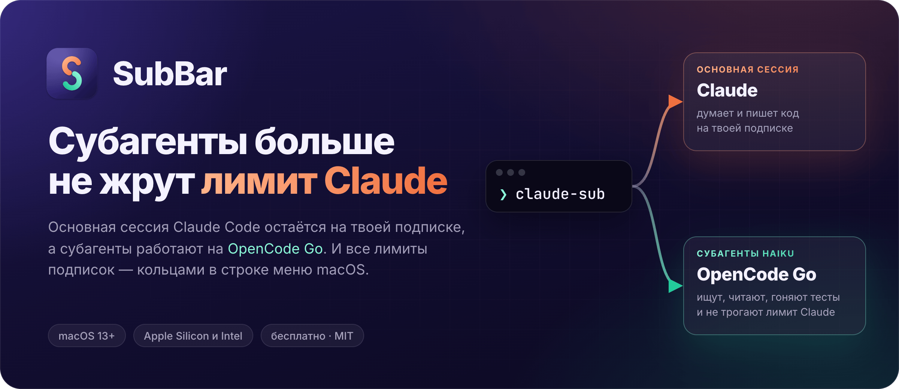
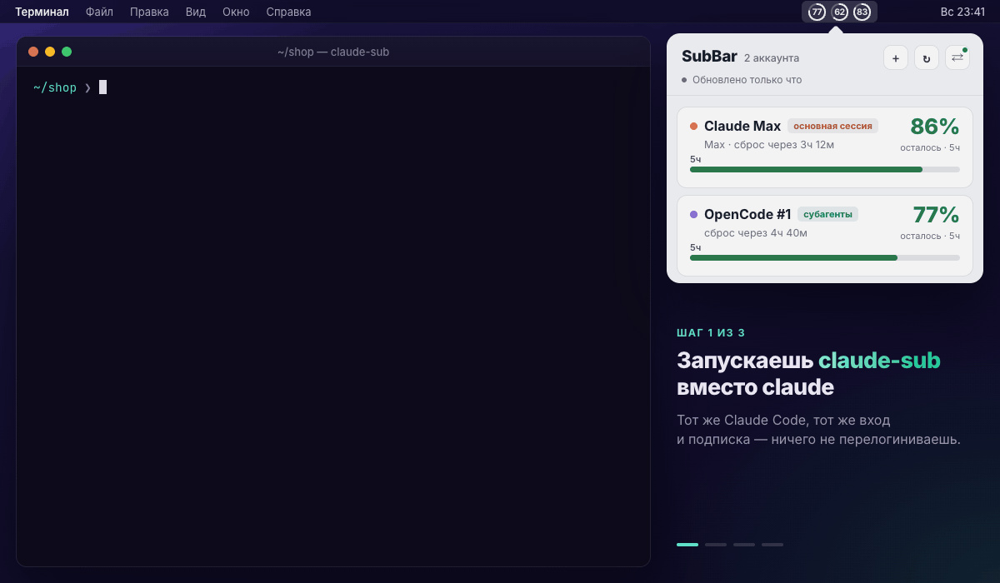
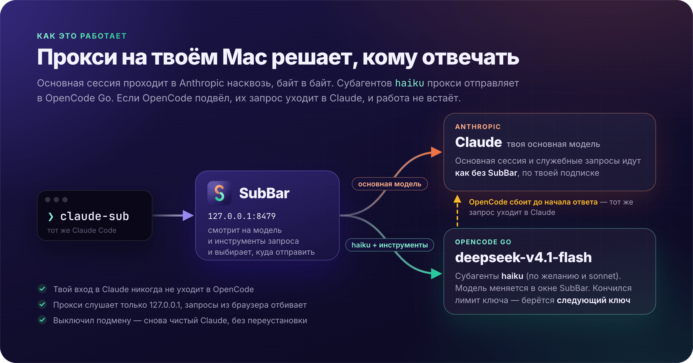
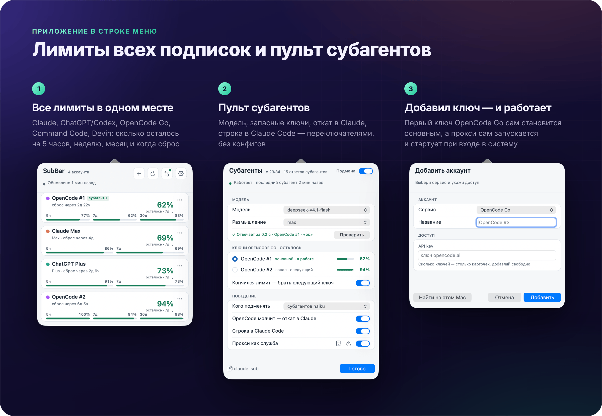

<p align="center">
  
</p>

<p align="center">
  <a href="https://github.com/Lutamona/SubBar/releases/latest"></a>
  
  
  <a href="LICENSE"></a>
</p>

<p align="center">
  
</p>

[English](README.en.md) · **Поставить за минуту** — вставь в Терминал (дальше [по шагам](#установка)):

```bash
curl -fsSL https://raw.githubusercontent.com/Lutamona/SubBar/main/scripts/get.sh | bash
```

## Зачем это

Claude Code на подписке упирается в лимиты: на 5 часов и на неделю. И тратит их не только на главное.
Когда Claude раздаёт работу субагентам — пройтись по коду, прочитать файлы, прогнать тесты, — они едят тот же лимит,
что и основная сессия. А субагентов на одну задачу бывает и три, и пять.

SubBar отдаёт эту рутину моделям [OpenCode Go](https://opencode.ai) (DeepSeek и другие) — у них свой, отдельный лимит.
Claude по-прежнему думает и пишет код на твоей подписке, а черновую работу делают субагенты на OpenCode.

- **Лимит Claude — на главное.** Поиск, чтение и прогоны субагентов уходят в OpenCode Go, подписка Claude остаётся основной сессии.
- **Ничего не ломается.** Основная сессия идёт в Anthropic байт в байт, как без SubBar. OpenCode сбоит — запрос
  субагента сам уходит в Claude, и работа не встаёт.
- **Видно, что подмена работает.** Внизу Claude Code — строка SubBar: модель субагентов, сколько их и сколько ответов пришло из OpenCode.
- **Все лимиты в строке меню.** Claude, ChatGPT/Codex, OpenCode Go, Command Code, Devin и любая подписка со своим
  JSON API: сколько осталось и когда сброс. Потрачено 90% — придёт уведомление (порог настраивается).
- **Несколько ключей OpenCode.** Кончился лимит на одном — субагенты сами переходят на следующий.
- **Никаких конфигов.** Добавил ключ — прокси сам запустился и дальше стартует при входе в систему. Выключил подмену
  одним переключателем — снова чистый Claude.
- **Бесплатно и открыто.** MIT, без своих серверов и телеметрии: всё работает на твоём Mac.

## Как это работает

<p align="center">
  
</p>

`claude-sub` запускает тот же Claude Code, только его запросы идут через маленький прокси на твоём Mac
(`127.0.0.1:8479`). Прокси смотрит на модель каждого запроса:

- **основная модель и служебные запросы** → Anthropic, по твоей подписке, байт в байт;
- **`haiku` с инструментами** (так работают субагенты) → OpenCode Go, на модели, которую ты выбрал в SubBar.

Твой вход в Claude (токен подписки) в OpenCode не уходит никогда: туда идёт только ключ OpenCode, и это проверяет
сквозной тест. Обычный `claude` работает как раньше, мимо прокси.

## Установка

### Что нужно

- Mac на **macOS 13** или новее — Apple Silicon или Intel.
- **[Claude Code](https://claude.com/claude-code)**, в который ты уже вошёл подпиской Pro или Max. Проверь: `claude` запускается и отвечает.
- **Ключ OpenCode Go** — оформи подписку на [opencode.ai](https://opencode.ai) и скопируй API-ключ.

### 1. Поставить SubBar

```bash
curl -fsSL https://raw.githubusercontent.com/Lutamona/SubBar/main/scripts/get.sh | bash
```

Скрипт скачает готовое приложение из последнего [релиза](https://github.com/Lutamona/SubBar/releases/latest), сверит
контрольную сумму, положит его в `/Applications/SubBar.app`, запустит и добавит команду `claude-sub`.
Ни Xcode, ни Rust не нужны. В строке меню появятся кольца SubBar.

> macOS спросит доступ к связке ключей «Claude Code-credentials» — нажми **«Разрешить всегда»**. Так SubBar видит
> лимиты твоей подписки Claude; токен уходит только в Anthropic.

Если скрипт напишет, что добавил `~/.local/bin` в PATH, открой новое окно Терминала — там заработает `claude-sub`.

### 2. Добавить ключ OpenCode Go

Значок SubBar в строке меню → **+** → **OpenCode Go** → вставь ключ → **Добавить**.

Всё: первый ключ сам становится основным для субагентов, а прокси сам запускается и дальше стартует при входе
в систему. Проверить связь: экран **«Субагенты»** (кнопка **⇄**) → **«Проверить»** →
`✓ Отвечает за 1,2 с · OpenCode Go · «ок»`.

Уже входил в OpenCode CLI? Тогда вместо вставки нажми **«Найти на этом Mac»** в той же форме — ключ подтянется сам.
Эта же кнопка найдёт входы ChatGPT/Codex, Command Code и Devin: они нужны только для лимитов, подмене — нет.
Карточка Claude появится сама.

Есть ещё ключи OpenCode — добавь каждый своей карточкой: кончится лимит на одном, субагенты перейдут на следующий.

### 3. Включить строку внизу Claude Code

Экран «Субагенты» → переключатель **«Строка в Claude Code»**. Или одной командой:

```bash
/Applications/SubBar.app/Contents/MacOS/SubBar statusline install
```

Своя строка состояния у тебя уже была — она останется первой, строка SubBar встанет второй. Копия настроек перед
правкой — `~/.claude/settings.json.subbar-backup`, убрать строку — та же команда с `remove`.

### 4. Запускать `claude-sub` вместо `claude`

```bash
claude-sub
```

Остальное как обычно, флаги тоже работают: `claude-sub --resume`, `claude-sub -p "…"`. Входить заново не надо —
это тот же Claude Code с тем же входом.

Дай задачу побольше и скажи «раздай субагентам» — Claude позовёт субагентов `haiku`, и они уйдут в OpenCode.
`claude-sub` сам подсказывает ему, что субагенты `haiku` теперь работают на OpenCode и рутину стоит отдавать им
(отключить подсказку: `SUBBAR_HINT=0 claude-sub`).

> Хочешь всегда через SubBar — добавь в `~/.zshrc` строку `alias claude='claude-sub'`. Это безопасно: сам
> `claude-sub` зовёт настоящий `claude`, а если прокси не отвечает — запускает его без подмены.

## Строка внизу Claude Code

По ней сразу видно, куда идут субагенты этой сессии:

| Строка | Что значит |
| --- | --- |
| 🟢 `deepseek-v4.1-flash · 3 аг · 28 отв` | всё работает: 3 субагента, 28 ответов пришли из OpenCode |
| ⚪ `deepseek-v4.1-flash · пока не запускались` | сессия идёт через SubBar, субагентов ещё не было |
| ⚪ `… · ключ OpenCode #2` | ответил запасной ключ: на основном кончился лимит |
| 🟡 `… · 2 в Claude` | 2 запроса откатились на настоящий Claude (OpenCode сбоил) — они тратят подписку |
| 🔴 `… · 1 ош` | были ошибки — загляни в журнал |
| 🟡 `подмена выключена · настоящий Claude` | подмену выключили в окне SubBar |
| 🟡 `нет ключа OpenCode Go · настоящий Claude` | добавь ключ ([шаг 2](#2-добавить-ключ-opencode-go)) |
| ⚪ `настоящий Claude · не через claude-sub` | запущен обычный `claude` |
| ⚪ `настоящий Claude · прокси SubBar не запущен` | прокси не работает: «Субагенты» → «Прокси как служба» или **↻** рядом |
| 🔴 `прокси SubBar не отвечает — запросы сессии не проходят` | прокси пропал посреди сессии: «Субагенты» → **↻**, или перезапусти `claude-sub` |

Из Терминала:

```bash
curl -s 127.0.0.1:8479/_subbar/status    # статус прокси
tail -f ~/Library/Logs/SubBar/proxy.log  # журнал
```

## Приложение в строке меню

<p align="center">
  
</p>

Кольца в строке меню — до трёх окон лимита одной подписки: закреплённой или самой израсходованной. У Claude это
5 часов и неделя, у OpenCode Go — ещё и месяц. Клик — все подписки списком. Экран **«Субагенты»** (**⇄**) — пульт подмены: модель, ключи, откат в Claude,
строка в Claude Code.

## Ставишь через нейросеть?

Скопируй это своему агенту — Claude Code, Cursor или Codex:

```text
Установи SubBar: https://github.com/Lutamona/SubBar — действуй строго по docs/FOR-AI.md
и проверяй каждый шаг. Ключ OpenCode Go я добавлю сам в окне SubBar.
```

В [docs/FOR-AI.md](docs/FOR-AI.md) — всё для агента: установка, строка внизу Claude Code, правильный запуск,
проверка и что делать, если что-то пошло не так.

## Частые вопросы

<details>
<summary><b>Это безопасно для моей подписки Claude?</b></summary>

Прокси передаёт запросы основной сессии в Anthropic байт в байт — тот же вход, те же запросы, что и без SubBar.
Токен подписки Claude никогда не уходит в OpenCode: туда идёт только ключ OpenCode, и на это есть сквозной тест.
Прокси слушает только `127.0.0.1` и отбивает запросы из браузера, так что открытая вкладка не потратит твою квоту.

Одно исключение из «байт в байт»: если сессию вели на OpenCode (например, основная модель попала под подмену),
а потом вернули в Claude, прокси убирает из истории «мысли» модели OpenCode. С чужой подписью Anthropic отвечал бы
ошибкой на каждом ходу.
</details>

<details>
<summary><b>Сколько это экономит?</b></summary>

Зависит от того, сколько работы Claude отдаёт субагентам. Всё, что ушло в OpenCode, не тратит лимит Claude, — это
видно по счётчику ответов в строке внизу. Основная сессия по-прежнему идёт по подписке Claude, а у OpenCode Go свой
лимит: он виден в карточке SubBar.
</details>

<details>
<summary><b>На каких моделях работают субагенты?</b></summary>

`deepseek-v4.1-flash` (по умолчанию), `space-bunny-free` или `muse-spark-1.3-contributor` — выбирается на экране
«Субагенты», там же уровень размышления.
</details>

<details>
<summary><b>А sonnet тоже можно отправить в OpenCode?</b></summary>

Да: «Субагенты» → «Кого подменять» → «haiku и sonnet». Учти: подмена смотрит на модель запроса, а не на то, кто его
сделал. Если основная сессия сама работает на подменяемой модели — например, на Sonnet в этом режиме, — она тоже
уйдёт в OpenCode.
</details>

<details>
<summary><b>OpenCode лёг или кончился лимит — что будет?</b></summary>

Временный сбой — два быстрых повтора. Не помогло — запрос уходит в настоящий Claude (тратит подписку, строка покажет
`· N в Claude`). Кончился лимит ключа — берётся следующий ключ из карточек, основной вернётся сам после сброса.
О таком SubBar сообщит уведомлением macOS.
</details>

<details>
<summary><b>Прокси не запущен — Claude сломается?</b></summary>

Нет. `claude-sub` подождёт прокси до 20 секунд (если служба как раз перезапускается — до 90), а если тот так и не
ответит — предупредит и запустит обычный Claude без подмены.
</details>

<details>
<summary><b>Где мои данные?</b></summary>

`~/Library/Application Support/SubBar/`: главное там — `state.json` (подписки и ключи) и `proxy.json` (настройки
прокси). Читать их может только твой пользователь. Ключи лежат в открытом виде, как и у самих CLI.

SubBar ходит в сеть только к самим сервисам: Anthropic, OpenCode, ChatGPT, Command Code и адрес своей подписки,
если ты его задал. Лимиты Devin он берёт у самого Devin CLI. Ни серверов разработчика, ни телеметрии.
</details>

<details>
<summary><b>macOS пишет «не удаётся проверить разработчика»</b></summary>

Приложение подписано без сертификата Apple Developer. Скрипт установки сам снимает пометку «скачано из интернета»;
если ставил вручную из архива — выполни:

```bash
xattr -dr com.apple.quarantine /Applications/SubBar.app
```
</details>

<details>
<summary><b>Как обновить?</b></summary>

Той же строкой, что и установка: поставит последнюю версию поверх, ключи и настройки останутся. Прокси
перезапустится мягко — начатые запросы доделает.
</details>

<details>
<summary><b>Как удалить?</b></summary>

```bash
SB=/Applications/SubBar.app/Contents/MacOS/SubBar
"$SB" statusline remove                                  # строка в Claude Code
"$SB" proxy-service off                                  # прокси
launchctl bootout "gui/$(id -u)/ai.subbar" 2>/dev/null   # автозапуск
pkill -x SubBar                                          # само приложение
rm -rf /Applications/SubBar.app ~/.local/bin/claude-sub ~/Library/Logs/SubBar \
  "$HOME/Library/Application Support/SubBar" \
  ~/Library/LaunchAgents/ai.subbar.plist ~/Library/LaunchAgents/ai.subbar.proxy.plist \
  ~/.claude/settings.json.subbar-backup ~/.claude/settings.json.subbar.lock
```

Строку `export PATH="$HOME/.local/bin:$PATH"` с пометкой SubBar в `~/.zshrc` (или `~/.bash_profile`) можно оставить — она ничему не мешает.
</details>

## Собрать из исходников

Нужны Command Line Tools (`xcode-select --install`) и [Rust](https://rustup.rs):

```bash
git clone https://github.com/Lutamona/SubBar.git && cd SubBar
./scripts/install.sh   # соберёт, положит в /Applications и запустит
cargo test             # юнит-тесты и сквозные тесты прокси на фейковых серверах
```

Все экраны и настройки, CLI и устройство прокси — в [docs/REFERENCE.md](docs/REFERENCE.md).

## Лицензия

[MIT](LICENSE). Проект не связан с Anthropic и OpenCode.

Если SubBar сберёг тебе лимит — поставь ⭐, так его найдут другие.
